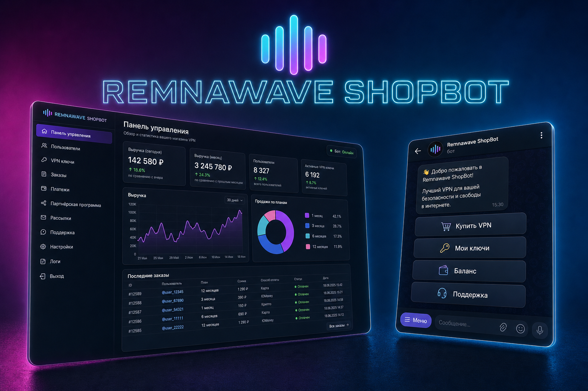
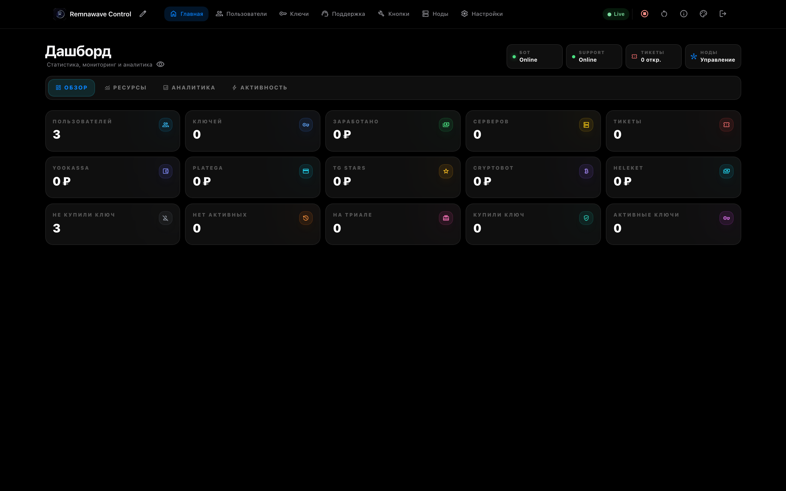
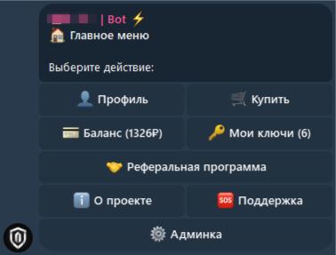
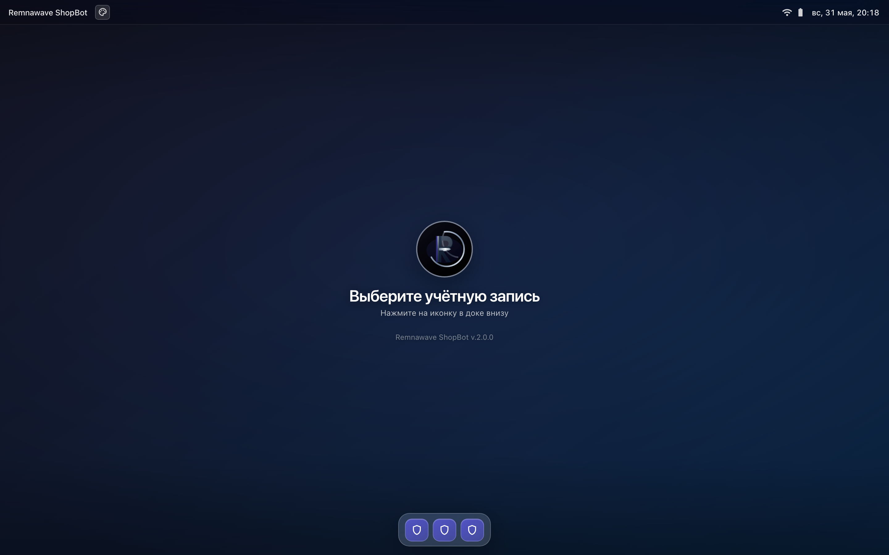
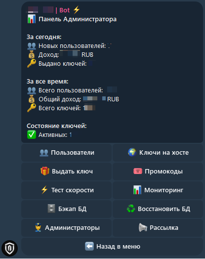

<div align="center">

# 🛍️ Remnawave App

**Telegram-магазин VPN-подписок с веб-панелью**

Работает вместе с [Remnawave Panel](https://github.com/remnawave/panel):  
**оплата в боте → ключ в Remnawave → конфиг пользователю**

<br>

[](https://github.com/kissesses/remnawave-app/releases)
[](LICENSE)
[](https://github.com/kissesses/remnawave-app/pkgs/container/remnawave-app)

<br>

[🚀 Установка](#-установка) ·
[📖 Полная инструкция](docs/INSTALL.md) ·
[🛠 Developer Support](docs/DEVELOPER-SUPPORT.md) ·
[💎 Поддержать](#-поддержать-проект) ·
[📸 Скриншоты](#-скриншоты)

</div>

<br>

<p align="center">
  
</p>

---

## Зачем это нужно

Remnawave App — **витрина и касса** поверх Remnawave. Без Remnawave Panel приложение не выдаёт ключи.

| Вы делаете | Remnawave App делает |
|------------|----------------|
| Ставите Remnawave + Remnawave App на один VPS | Продаёт подписки в Telegram |
| Настраиваете тарифы и оплату в панели | Создаёт пользователей и ключи через API Remnawave |
| — | Бэкапит Remnawave App **и** Remnawave (ReSTEAL, AES-256) |

---

## 🚀 Установка

### Что нужно заранее

| | |
|---|---|
| 🌊 **Remnawave** | **[Установлена и работает](https://docs.rw/docs/install/remnawave-panel)** до Remnawave App: `/opt/remnawave`, сеть `remnawave-network`, HTTPS на `panel.*` |
| 🖥 **Сервер** | Ubuntu 22.04+ / Debian 11+, 2 GB RAM (лучше 4 GB), Docker 24+ и Compose v2 |
| 🌐 **Домены** | `panel.example.com` (Remnawave) + `shop.example.com` (Remnawave App) — **разные** поддомены |
| 🤖 **Telegram** | Токен от [@BotFather](https://t.me/botfather) |

Подробные требования и проверки: **[docs/INSTALL.md](docs/INSTALL.md#-требования)**

---

### Шаг 1 · Remnawave Panel (обязательно)

**Без работающей Remnawave App не ставится.** Сначала панель по официальной инструкции:  
**[docs.rw — Remnawave Panel](https://docs.rw/docs/install/remnawave-panel)**

```bash
# Проверка после установки Remnawave
docker ps | grep remnawave
docker network inspect remnawave-network >/dev/null && echo "✓ сеть OK"
```

---

### Шаг 2 · Remnawave App

```bash
mkdir /opt/remnawave-app && cd /opt/remnawave-app

curl -o docker-compose.yml \
  https://raw.githubusercontent.com/kissesses/remnawave-app/main/docker-compose.yml

curl -o .env \
  https://raw.githubusercontent.com/kissesses/remnawave-app/main/.env.example

pw=$(openssl rand -hex 24) && sed -i "s/^POSTGRES_PASSWORD=.*/POSTGRES_PASSWORD=$pw/" .env
sk=$(openssl rand -hex 64)
sed -i -E "s/^#? ?SHOPBOT_SECRET_KEY=.*/SHOPBOT_SECRET_KEY=${sk}/" .env
grep -qE '^SHOPBOT_SECRET_KEY=' .env || echo "SHOPBOT_SECRET_KEY=${sk}" >> .env
mk=$(openssl rand 32 | openssl base64 -A | tr '+/' '-_')
sed -i -E "s/^#? ?SHOPBOT_MASTER_KEY=.*/SHOPBOT_MASTER_KEY=${mk}/" .env
grep -qE '^SHOPBOT_MASTER_KEY=' .env || echo "SHOPBOT_MASTER_KEY=${mk}" >> .env
rp=$(openssl rand -hex 24)
grep -qE '^REDIS_PASSWORD=' .env \
  && sed -i -E "s/^#? ?REDIS_PASSWORD=.*/REDIS_PASSWORD=${rp}/" .env \
  || echo "REDIS_PASSWORD=${rp}" >> .env
sed -i -E "s|^#? ?SHOPBOT_REDIS_URL=.*|SHOPBOT_REDIS_URL=redis://:${rp}@redis:6379/0|" .env
grep -qE '^SHOPBOT_REDIS_URL=' .env || echo "SHOPBOT_REDIS_URL=redis://:${rp}@redis:6379/0" >> .env
chmod 600 .env

docker network inspect remnawave-network >/dev/null && echo "✓ сеть OK"
test -f /opt/remnawave/.env && echo "✓ Remnawave OK"

docker compose pull
docker compose up -d && docker compose logs -f -t
```

> ⚠️ Для доступа из интернета настройте **reverse proxy в Nginx Remnawave**  
> (`remnawave-nginx` → `remnawave-app:1337`). См. [docs/INSTALL.md → Nginx](docs/INSTALL.md#-nginx-remnawave).

---

### Шаг 3 · Первый запуск

| # | Действие |
|---|----------|
| 1 | Откройте `https://shop.example.com/setup` |
| 2 | Укажите **Remnawave API token**, логин и пароль админа |
| 3 | **Настройки → Telegram** — токен бота, username, ваш ID |
| 4 | **Настройки → Хосты** — URL и API Remnawave |
| 5 | **Тарифы → Запустить бота** |

```
✅ Готово — бот принимает заказы
```

---

## 🔄 Обновление

**Из панели:** **О проекте → Обновить** (нужны `SHOPBOT_IMAGE_TAG=latest` и смонтированный Docker socket — см. [docs/INSTALL.md](docs/INSTALL.md#-обновление)).

**Вручную на сервере:**

```bash
cd /opt/remnawave-app
docker compose pull && docker compose up -d --force-recreate
```

При смене `docker-compose.yml` в репозитории:

```bash
cd /opt/remnawave-app
curl -fsSL -o docker-compose.yml \
  https://raw.githubusercontent.com/kissesses/remnawave-app/main/docker-compose.yml
docker compose pull && docker compose up -d --force-recreate
```

Подробнее: [**docs/INSTALL.md → Обновление**](docs/INSTALL.md#-обновление)

---

## ✨ Возможности

| | | |
|:---:|:---:|:---:|
| 🤖 Telegram-бот | 💳 YooKassa, CryptoBot, TON, Stars… | 🔐 TOTP · Passkey · Telegram Login |
| 🖥 Веб-панель | 📊 Дашборд и мониторинг | 🗄 ReSTEAL-бэкапы (AES + Telegram) |
| 🤝 Рефералы | 📢 Рассылки и промокоды | 🛡 RBAC для команды |

---

## 📸 Скриншоты

<details>
<summary><b>Показать скриншоты</b></summary>

| Панель | Бот |
|:---:|:---:|
|  |  |
|  |  |

</details>

---

## 📚 Документация

| Документ | О чём |
|----------|--------|
| [**docs/INSTALL.md**](docs/INSTALL.md) | Установка, co-install, Nginx Remnawave, диагностика |
| [**docs/CHANGELOG.md**](docs/CHANGELOG.md) | История версий |
| [**.env.example**](.env.example) | Все переменные окружения |

---

## 💎 Поддержать проект

Remnawave App — open source. Если проект полезен — можно поддержать разработку:

<div align="center">

| 💠 **TON** | 💵 **USDT (TON)** |
|:----------:|:-----------------:|
| Сеть **TON** · один адрес для обоих активов |

<br>

```
UQAIaNG4ccxBDViWi3hISWeZEHDM1LvBrV292USg_A0AERHF
```

<br>

🙏 **Спасибо** — это мотивирует развивать Remnawave App дальше

</div>

Также: ⭐ [звезда на GitHub](https://github.com/kissesses/remnawave-app) · 🐛 [Issues](https://github.com/kissesses/remnawave-app/issues)

---

## 🆘 Помощь

- 🐛 [Issues](https://github.com/kissesses/remnawave-app/issues) — баги и предложения
- 📦 [Releases](https://github.com/kissesses/remnawave-app/releases) — версии и образы
- 🐳 [GHCR](https://github.com/kissesses/remnawave-app/pkgs/container/remnawave-app) — Docker `latest`

---

<div align="center">

**MIT** · [kissesses/remnawave-app](https://github.com/kissesses/remnawave-app)

⭐ Звёздочка на GitHub помогает проекту

</div>
