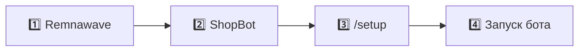

<div align="center">

# 📖 Установка Remnawave ShopBot

**Co-install с [Remnawave Panel](https://github.com/remnawave/panel) на одном сервере**

<br>

[✅ Требования](#-требования) ·
[🚀 Быстрый старт](#-быстрый-старт) ·
[🔐 Секреты](#-секреты-для-env) ·
[🛡 Prod](#-prod-hardening) ·
[🔄 Обновление](#-обновление) ·
[🌐 Nginx](#-nginx-remnawave) ·
[🆘 Проблемы](#-типичные-сложности) ·
[💎 Поддержка](#-поддержать-проект)

</div>

---

## 🌊 Зачем нужна Remnawave Panel

**Remnawave ShopBot** — магазин и панель поверх Remnawave. Бот продаёт VPN-подписки, ключи создаются через **API Remnawave**.

| ❌ Без Remnawave | ✅ С Remnawave (рекомендуется) |
|------------------|--------------------------------|
| Нельзя выдавать ключи | Оплата → ключ в Remnawave → конфиг пользователю |
| Нет бэкапа Panel из ShopBot | Бэкап ShopBot **и** Remnawave (Postgres + compose) |
| Ручная настройка хостов | Одна инфраструктура на одном VPS |

> 💡 ShopBot **не заменяет** Remnawave Panel. Сначала панель, потом бот — на **одном** сервере.

---

## ✅ Требования

ShopBot ставится **только поверх уже работающей** [Remnawave Panel](https://docs.rw/docs/install/remnawave-panel). Без неё установка бессмысленна: ключи пользователям не выдаются.

### 🌊 Remnawave Panel — обязательно

| | |
|---|---|
| 📦 **Установка** | По [официальной инструкции Remnawave](https://docs.rw/docs/install/remnawave-panel) **до** ShopBot |
| 📁 **Каталог** | Обычно `/opt/remnawave` с `docker-compose.yml` и `.env` |
| 🌐 **Доступ** | Панель открывается по HTTPS (`panel.example.com`) |
| 🐳 **Сеть** | Docker-сеть **`remnawave-network`** (создаётся при установке Remnawave) |
| 🔀 **Nginx** | Reverse proxy Remnawave (`remnawave-nginx`) — ShopBot подключается к нему |

**Проверка перед установкой ShopBot** (все пункты должны пройти):

```bash
test -f /opt/remnawave/.env && echo "✓ Remnawave: каталог OK"
docker network inspect remnawave-network >/dev/null && echo "✓ Docker: сеть remnawave-network OK"
docker ps --format '{{.Names}}' | grep -qi remnawave && echo "✓ Docker: контейнеры Remnawave OK"
curl -sI https://panel.example.com | head -1   # замените на свой домен
```

Если что-то из списка падает — **сначала доведите Remnawave до рабочего состояния**, затем ставьте ShopBot.

### 🖥 Требования к серверу

| Параметр | Минимум | Рекомендуется |
|----------|---------|---------------|
| 🐧 **ОС** | Ubuntu 22.04 / Debian 11+ | Ubuntu 24.04 LTS |
| 🧠 **RAM** | 2 GB | 4 GB+ (Remnawave + ShopBot + PostgreSQL ×2 + Redis) |
| ⚙️ **CPU** | 1 vCPU | 2 vCPU |
| 💾 **Диск** | 20 GB свободно | 40 GB+ (бэкапы в Docker volumes) |
| 🔑 **Доступ** | SSH, root или sudo | — |

Один VPS: **Remnawave и ShopBot на одной машине** (co-install). Отдельный сервер только под ShopBot без Remnawave **не поддерживается** в этой инструкции.

### 🛠 ПО на сервере

| Компонент | Версия / примечание |
|-----------|---------------------|
| 🐳 **Docker** | 24.0+ ([get.docker.com](https://get.docker.com)) |
| 📦 **Docker Compose** | v2 (`docker compose`, не отдельный `docker-compose`) |
| 🔐 **OpenSSL** | для генерации секретов в `.env` |
| 📥 **curl** | скачивание `docker-compose.yml` и `.env.example` |

Проверка:

```bash
docker --version
docker compose version
openssl version
curl --version
```

### 🌐 Домены (DNS A → IP сервера)

| Сервис | Пример | Обязательно |
|--------|--------|:-----------:|
| 🌊 Remnawave Panel | `panel.example.com` | ✅ |
| 🛍 ShopBot — панель | `shop.example.com` | ✅ |
| 📱 ShopBot — WebApp | `app.example.com` | ➖ |

> ⚠️ Нужны **разные поддомены**. Один домен на Remnawave и ShopBot — частая причина ошибок SSL и маршрутизации.

### 🤖 Telegram

- Токен бота от [@BotFather](https://t.me/botfather)
- Ваш Telegram ID — [@userinfobot](https://t.me/userinfobot)
- API-токен Remnawave из панели (понадобится на `/setup` ShopBot)

### 📁 Каталог ShopBot

Как у Remnawave — **только конфиги**, без исходников:

```
/opt/remnawave-shopbot/
├── docker-compose.yml
└── .env
```

Образ: `ghcr.io/kissesses/rw-shop:latest` (тег в `.env` → `SHOPBOT_IMAGE_TAG`, рекомендуется `latest`)

---

## 🔐 Секреты для `.env`

Перед первым запуском контейнеров заполните секреты в `.env` Remnawave и ShopBot (см. [✅ Требования](#-требования)).


### 🌊 Remnawave — `/opt/remnawave/.env`

```bash
cd /opt/remnawave
test -f .env || { echo "Сначала: curl -o .env .../.env.sample"; exit 1; }

# 🐘 PostgreSQL + DATABASE_URL
pw=$(openssl rand -hex 24) && sed -i "s/^POSTGRES_PASSWORD=.*/POSTGRES_PASSWORD=$pw/" .env && sed -i "s|^\(DATABASE_URL=\"postgresql://postgres:\)[^@]*\(@.*\)|\1$pw\2|" .env

# 🔑 JWT
sed -i "s/^JWT_AUTH_SECRET=.*/JWT_AUTH_SECRET=$(openssl rand -hex 64)/" .env && sed -i "s/^JWT_API_TOKENS_SECRET=.*/JWT_API_TOKENS_SECRET=$(openssl rand -hex 64)/" .env
```

Остальное — по [docs.rw](https://docs.rw/docs/install/remnawave-panel).

### 🛍 ShopBot — `/opt/remnawave-shopbot/.env`

```bash
cd /opt/remnawave-shopbot
test -f .env || cp .env.example .env

# 🐘 PostgreSQL
pw=$(openssl rand -hex 24) && sed -i "s/^POSTGRES_PASSWORD=.*/POSTGRES_PASSWORD=$pw/" .env

# 🍪 Сессия Flask (cookie, CSRF)
sk=$(openssl rand -hex 64)
sed -i -E "s/^#? ?SHOPBOT_SECRET_KEY=.*/SHOPBOT_SECRET_KEY=${sk}/" .env
grep -qE '^SHOPBOT_SECRET_KEY=' .env || echo "SHOPBOT_SECRET_KEY=${sk}" >> .env

# 🔒 Шифрование секретов в БД (Fernet)
mk=$(openssl rand 32 | openssl base64 -A | tr '+/' '-_')
sed -i -E "s/^#? ?SHOPBOT_MASTER_KEY=.*/SHOPBOT_MASTER_KEY=${mk}/" .env
grep -qE '^SHOPBOT_MASTER_KEY=' .env || echo "SHOPBOT_MASTER_KEY=${mk}" >> .env

# 📮 Redis (rate limit входа)
rp=$(openssl rand -hex 24)
sed -i -E "s/^#? ?REDIS_PASSWORD=.*/REDIS_PASSWORD=${rp}/" .env
grep -qE '^REDIS_PASSWORD=' .env || echo "REDIS_PASSWORD=${rp}" >> .env
sed -i -E "s|^#? ?SHOPBOT_REDIS_URL=.*|SHOPBOT_REDIS_URL=redis://:${rp}@redis:6379/0|" .env
grep -qE '^SHOPBOT_REDIS_URL=' .env || echo "SHOPBOT_REDIS_URL=redis://:${rp}@redis:6379/0" >> .env

# 🔐 Права на .env
chmod 600 .env
```

Проверка:

```bash
grep -E '^(POSTGRES_PASSWORD|SHOPBOT_SECRET_KEY|SHOPBOT_MASTER_KEY|REDIS_PASSWORD)=' .env | sed 's/=.*/=***/'
ls -l .env   # ожидается -rw-------
```

> 💡 `POSTGRES_PASSWORD` в `.env.example` уже без `#`, поэтому первая команда срабатывает сразу.  
> `SHOPBOT_*` раньше были закомментированы — команды ниже с `-E` заменяют и `# KEY=`, и `KEY=`.

> 💡 Секреты генерируются командами `openssl` + `sed` (см. блоки ниже); после этого — `chmod 600 .env`.

> ⚠️ Не меняйте `POSTGRES_PASSWORD` после первого запуска PostgreSQL.  
> ⚠️ `SHOPBOT_MASTER_KEY` при смене ломает зашифрованные секреты в БД.

### 🛡 Prod-hardening (встроено в `docker-compose.yml`)

| Мера | Что делает |
|------|------------|
| **Без `ports` у Postgres/Redis** | БД и Redis только в Docker-сети, не на `127.0.0.1` хоста |
| **`env_file` только у ShopBot** | Секреты панели не попадают в env Postgres/Redis |
| **`REDIS_PASSWORD`** | Redis с `--requirepass` |
| **`SHOPBOT_REQUIRE_TOTP=1`** | 2FA обязательна для админов (TOTP / Passkey / Telegram) |
| **`security_opt` + `cap_drop`** | Меньше привилегий контейнеров |
| **`healthcheck`** | ShopBot, Postgres, Redis |
| **Лимиты RAM/CPU** | Контейнер не съедает весь VPS |

**PostgreSQL с хоста** (если нужен ручной доступ):

```bash
docker compose exec postgres psql -U shopbot -d shopbot
```

> Полный сценарий обновления с более старой версии — в разделе [🔄 Обновление](#-обновление).

---

## 🚀 Быстрый старт

Порядок строгий: **сначала Remnawave, потом ShopBot**. Если панель уже стоит и [проверки из «Требований»](#-требования) проходят — начинайте с шага **2️⃣**.



### 1️⃣ Remnawave Panel

📚 **[Официальная инструкция docs.rw](https://docs.rw/docs/install/remnawave-panel)**

```bash
mkdir /opt/remnawave && cd /opt/remnawave

curl -o docker-compose.yml \
  https://raw.githubusercontent.com/remnawave/backend/refs/heads/main/docker-compose-prod.yml
curl -o .env \
  https://raw.githubusercontent.com/remnawave/backend/refs/heads/main/.env.sample

# 🔐 Секреты
pw=$(openssl rand -hex 24) && sed -i "s/^POSTGRES_PASSWORD=.*/POSTGRES_PASSWORD=$pw/" .env && sed -i "s|^\(DATABASE_URL=\"postgresql://postgres:\)[^@]*\(@.*\)|\1$pw\2|" .env
sed -i "s/^JWT_AUTH_SECRET=.*/JWT_AUTH_SECRET=$(openssl rand -hex 64)/" .env && sed -i "s/^JWT_API_TOKENS_SECRET=.*/JWT_API_TOKENS_SECRET=$(openssl rand -hex 64)/" .env

docker compose up -d && docker compose logs -f -t
```

✅ **Проверка:**

```bash
docker ps | grep -i remnawave
docker network inspect remnawave-network >/dev/null && echo "✓ сеть OK"
curl -sI https://panel.example.com | head -1
```

---

### 2️⃣ ShopBot

```bash
mkdir /opt/remnawave-shopbot && cd /opt/remnawave-shopbot

curl -o docker-compose.yml \
  https://raw.githubusercontent.com/kissesses/rw-shop/main/docker-compose.yml
curl -o .env \
  https://raw.githubusercontent.com/kissesses/rw-shop/main/.env.example

# 🔐 Секреты (полный блок — см. также раздел «Секреты для .env»)
pw=$(openssl rand -hex 24) && sed -i "s/^POSTGRES_PASSWORD=.*/POSTGRES_PASSWORD=$pw/" .env
sk=$(openssl rand -hex 64)
sed -i -E "s/^#? ?SHOPBOT_SECRET_KEY=.*/SHOPBOT_SECRET_KEY=${sk}/" .env
grep -qE '^SHOPBOT_SECRET_KEY=' .env || echo "SHOPBOT_SECRET_KEY=${sk}" >> .env
mk=$(openssl rand 32 | openssl base64 -A | tr '+/' '-_')
sed -i -E "s/^#? ?SHOPBOT_MASTER_KEY=.*/SHOPBOT_MASTER_KEY=${mk}/" .env
grep -qE '^SHOPBOT_MASTER_KEY=' .env || echo "SHOPBOT_MASTER_KEY=${mk}" >> .env
rp=$(openssl rand -hex 24)
grep -qE '^REDIS_PASSWORD=' .env \
  && sed -i -E "s/^#? ?REDIS_PASSWORD=.*/REDIS_PASSWORD=${rp}/" .env \
  || echo "REDIS_PASSWORD=${rp}" >> .env
sed -i -E "s|^#? ?SHOPBOT_REDIS_URL=.*|SHOPBOT_REDIS_URL=redis://:${rp}@redis:6379/0|" .env
grep -qE '^SHOPBOT_REDIS_URL=' .env || echo "SHOPBOT_REDIS_URL=redis://:${rp}@redis:6379/0" >> .env
grep -q '^SHOPBOT_REQUIRE_TOTP=' .env \
  || echo 'SHOPBOT_REQUIRE_TOTP=1' >> .env
chmod 600 .env

docker network inspect remnawave-network >/dev/null && echo "✓ сеть OK"
test -f /opt/remnawave/.env && echo "✓ Remnawave OK"

docker compose pull && docker compose up -d
```

> 🌐 **Reverse proxy обязателен** — ShopBot слушает `127.0.0.1:1337`.  
> Настройте **Nginx Remnawave** → [раздел ниже](#-nginx-remnawave).

**Что поднимает `docker compose`:**

- 🐳 ShopBot + PostgreSQL 18 + Redis 8 в сети `remnawave-network`
- 🔐 Секреты из `.env` (Postgres, ShopBot, Redis)
- 🛡 Prod-hardening в `docker-compose.yml` (без ports у БД, healthcheck, лимиты RAM)

---

### 3️⃣ Первичная настройка

| # | Действие |
|:-:|----------|
| 1️⃣ | `https://shop.example.com/setup` — API token Remnawave, логин, пароль (≥ 12 символов) |
| 2️⃣ | `/login` — TOTP / Passkey / Telegram |
| 3️⃣ | **Настройки → Telegram** — токен, username, ID админа |
| 4️⃣ | **Настройки → Хосты** — URL и API Remnawave |
| 5️⃣ | **Тарифы → Запустить бота** 🚀 |

---

### 4️⃣ Бэкапы (рекомендуется)

- 🗄 **Бэкапы** — расписание, AES-256, сжатие level 9
- 🌊 **Remnawave Panel** — дамп Postgres + tar `/opt/remnawave`
- 📨 **Настройки → Боты → Каналы** — архив и пароль в разные Telegram-топики

---

## 🌐 Nginx (Remnawave)

ShopBot — **только в Docker**. Публичный доступ через **`remnawave-nginx`** (сеть `remnawave-network`).

| Сервис | Домен | Upstream |
|--------|-------|----------|
| 🌊 Panel | `panel.example.com` | `remnawave:3000` |
| 🛍 ShopBot | `shop.example.com` | `remnawave-shopbot:1337` |
| 📱 WebApp | `app.example.com` | `remnawave-shopbot:8000` |

**Upstream:**

```nginx
upstream shopbot {
    server remnawave-shopbot:1337;
}

upstream shopbot_webapp {
    server remnawave-shopbot:8000;
}
```

**Server block (панель ShopBot):**

```nginx
server {
    server_name shop.example.com;
    listen 443 ssl;
    listen [::]:443 ssl;
    http2 on;

    location / {
        proxy_http_version 1.1;
        proxy_pass http://shopbot;
        proxy_set_header Host $host;
        proxy_set_header X-Real-IP $remote_addr;
        proxy_set_header X-Forwarded-For $proxy_add_x_forwarded_for;
        proxy_set_header X-Forwarded-Proto $scheme;
    }
}
```

Конфиг: `/opt/remnawave/nginx` · [docs.rw](https://docs.rw/docs/install/remnawave-panel)

> ⚠️ **Не используйте `127.0.0.1:1337` в `remnawave-nginx`.**  
> С хоста `curl http://127.0.0.1:1337` работает, но внутри контейнера nginx `127.0.0.1` — это сам nginx → **502 Bad Gateway**.  
> Нужно только **`remnawave-shopbot:1337`** (и `remnawave-shopbot:8000` для WebApp).

```bash
docker exec remnawave-nginx nginx -t && docker exec remnawave-nginx nginx -s reload
```

> 💡 Системный Nginx на хосте **не нужен** (для co-install). На **host nginx** upstream `127.0.0.1:1337` — нормально.

---

## 💾 Docker volumes

| Volume | Содержимое |
|--------|------------|
| `postgres-data` | 🐘 PostgreSQL 18 ShopBot |
| `redis-data` | ⚡ Redis 8 |
| `shopbot-data` | 🔑 резерв под `.master.key` (если нет `SHOPBOT_MASTER_KEY` в `.env`; часто пусто) |
| `backups-data` | 📦 ZIP-архивы (не в `./backups/` на хосте) |

```bash
docker compose exec remnawave-shopbot ls -la /app/project/backups
docker volume inspect remnawave-shopbot_backups-data
```

---

## 🔄 Обновление

### Из панели (рекомендуется)

В **О проекте** при доступном релизе — кнопка **«Обновить»** с прогрессом.

Требования:

1. `SHOPBOT_IMAGE_TAG=latest` (или `stable`) в `.env`
2. В `docker-compose.yml` для `remnawave-shopbot` **раскомментировать**:

```yaml
- /var/run/docker.sock:/var/run/docker.sock
- /opt/remnawave-shopbot:/opt/remnawave-shopbot:ro
```

3. Образ GHCR собирается с `INSTALL_DOCKER_CLI=1` (для обновления из панели). Самостоятельная сборка без Docker CLI: `docker build --build-arg INSTALL_DOCKER_CLI=0 .` — меньший размер pull
4. `SHOPBOT_COMPOSE_PROJECT_DIR=/opt/remnawave-shopbot` в environment (уже в compose по умолчанию)

Без socket и каталога проекта панель покажет команду для SSH и ссылку на релизы.

### Вручную на сервере

```bash
cd /opt/remnawave-shopbot
docker compose pull && docker compose up -d --force-recreate
```

При обновлении `docker-compose.yml` в репозитории:

```bash
cd /opt/remnawave-shopbot

curl -fsSL -o docker-compose.yml \
  https://raw.githubusercontent.com/kissesses/rw-shop/main/docker-compose.yml

docker compose pull && docker compose up -d --force-recreate
```

### Полное обновление (compose + Redis + prod-флаги)

Если поднимаете систему с более старой версии или меняли `.env`:

```bash
cd /opt/remnawave-shopbot

# 1. Новый compose
curl -fsSL -o docker-compose.yml \
  https://raw.githubusercontent.com/kissesses/rw-shop/main/docker-compose.yml

# 2. Redis (только если пароля ещё нет — не перегенерируйте без нужды!)
if ! grep -qE '^REDIS_PASSWORD=.+' .env 2>/dev/null; then
  rp=$(openssl rand -hex 24)
  grep -qE '^REDIS_PASSWORD=' .env \
    && sed -i -E "s/^#? ?REDIS_PASSWORD=.*/REDIS_PASSWORD=${rp}/" .env \
    || echo "REDIS_PASSWORD=${rp}" >> .env
  sed -i -E "s|^#? ?SHOPBOT_REDIS_URL=.*|SHOPBOT_REDIS_URL=redis://:${rp}@redis:6379/0|" .env
  grep -qE '^SHOPBOT_REDIS_URL=' .env || echo "SHOPBOT_REDIS_URL=redis://:${rp}@redis:6379/0" >> .env
elif ! grep -qE '^SHOPBOT_REDIS_URL=redis://:' .env 2>/dev/null; then
  rp=$(grep '^REDIS_PASSWORD=' .env | cut -d= -f2-)
  sed -i -E "s|^#? ?SHOPBOT_REDIS_URL=.*|SHOPBOT_REDIS_URL=redis://:${rp}@redis:6379/0|" .env
  grep -qE '^SHOPBOT_REDIS_URL=' .env || echo "SHOPBOT_REDIS_URL=redis://:${rp}@redis:6379/0" >> .env
fi

# 3. Prod: обязательная 2FA (если ещё не задано)
grep -q '^SHOPBOT_REQUIRE_TOTP=' .env \
  && sed -i 's/^SHOPBOT_REQUIRE_TOTP=.*/SHOPBOT_REQUIRE_TOTP=1/' .env \
  || echo 'SHOPBOT_REQUIRE_TOTP=1' >> .env

# 4. Тег образа (latest)
grep -q '^SHOPBOT_IMAGE_TAG=' .env \
  && sed -i 's/^SHOPBOT_IMAGE_TAG=.*/SHOPBOT_IMAGE_TAG=latest/' .env \
  || echo 'SHOPBOT_IMAGE_TAG=latest' >> .env

chmod 600 .env

# 5. Перезапуск
docker compose pull
docker compose up -d --force-recreate
```

Проверка после обновления:

```bash
docker compose ps
grep -E '^(REDIS_PASSWORD|SHOPBOT_IMAGE_TAG|SHOPBOT_REQUIRE_TOTP)=' .env | sed 's/=.*/=***/'
ss -tlnp | grep 7777 || echo "✓ Postgres не слушает хост (ожидаемо)"
docker compose exec redis redis-cli -a "$(grep '^REDIS_PASSWORD=' .env | cut -d= -f2-)" ping
```

> ⚠️ После смены `REDIS_PASSWORD` все контейнеры должны пересоздаться (`--force-recreate`), иначе ShopBot останется со старым URL.

---

## 🔄 Управление

```bash
cd /opt/remnawave-shopbot

docker compose ps
docker compose logs -f remnawave-shopbot
docker compose pull && docker compose up -d --force-recreate
```

---

## 🆘 502 Bad Gateway (Nginx Remnawave)

**Чаще всего (co-install):** в `/opt/remnawave/nginx` указан **`127.0.0.1:1337`** вместо **`remnawave-shopbot:1337`**. ShopBot при этом healthy, `curl` с хоста на `127.0.0.1:1337` — OK.

| Проверка | OK | Проблема |
|----------|-----|----------|
| `curl http://127.0.0.1:1337/login` с хоста | ответ / редирект | контейнер ShopBot |
| `docker exec remnawave-nginx curl … http://remnawave-shopbot:1337/login` | 302/200 | **nginx upstream** |
| `grep remnawave-shopbot /opt/remnawave/nginx/` | есть `remnawave-shopbot:1337` | нет server block / неверный upstream |

```bash
cd /opt/remnawave-shopbot
docker compose ps
curl -fsS http://127.0.0.1:1337/login >/dev/null && echo OK-host || echo FAIL-host
docker exec remnawave-nginx curl -fsS --max-time 3 http://remnawave-shopbot:1337/login >/dev/null \
  && echo OK-nginx || echo FAIL-nginx
grep -r "shopbot\|1337\|remnawave-shopbot" /opt/remnawave/nginx/conf.d/ /opt/remnawave/nginx/ 2>/dev/null | head -20
docker compose logs remnawave-shopbot --tail 40
```

Исправление upstream → `remnawave-shopbot:1337`, затем:

```bash
docker exec remnawave-nginx nginx -t && docker exec remnawave-nginx nginx -s reload
```

**Если FAIL-host** — Docker (не nginx):

```bash
cd /opt/remnawave-shopbot
docker compose up -d --force-recreate
sleep 20
curl -fsS http://127.0.0.1:1337/login | head -3
```

Реже: контейнер **Restarting** (БД в логах), ShopBot не в сети `remnawave-network`, несовпадение `POSTGRES_PASSWORD` с томом Postgres.

---

## Advanced (не обязательно для shop)

| Функция | Где | Зачем |
|---------|-----|-------|
| **Stealth login** | Настройки → Stealth login | Скрытый вход через decoy-страницы; по умолчанию выключен |
| **SQL browser** | Настройки → База данных | Просмотр таблиц; требует step-up 2FA |
| **Node panel** | Dock → Ноды | SSH-деплой; только для ops-команды |
| **RePanel white-label** | [RE-PANEL-INSTALL.md](RE-PANEL-INSTALL.md) | Форк Remnawave Panel, **не** установка магазина |

---

## 🆘 Типичные сложности

| # | Проблема | Решение |
|:-:|----------|---------|
| 0️⃣ | 🌐 **502 Bad Gateway** | См. раздел [502 выше](#-502-bad-gateway-nginx-remnawave) |
| 1️⃣ | 🤖 Бот не выдаёт ключи | `/setup`, **Настройки → Хосты**, доступность Panel |
| 2️⃣ | 🔒 SSL / DNS | `dig +short shop.example.com` → IP сервера; Cloudflare → DNS only |
| 3️⃣ | ⚡ Redis unavailable | Проверьте `REDIS_PASSWORD` и `SHOPBOT_REDIS_URL` в `.env` → [Redis](#-redis--подробное-решение) |
| 4️⃣ | 🗄 Бэкап Remnawave «не настроен» | `/opt/remnawave`, сеть `remnawave-network`, сервис **`remnawave-db`** |
| 5️⃣ | 🍪 CSRF expired | Обновить ShopBot, F5 |
| 6️⃣ | 🔑 Passkey не работает | `SHOPBOT_RP_ID` + `SHOPBOT_RP_ORIGIN` в `.env` |
| 7️⃣ | 🚪 Разлогин после рестарта | Задайте `SHOPBOT_SECRET_KEY` |
| 8️⃣ | 🔌 Конфликт портов | ShopBot на хосте: `1337`, `8000` (localhost) · Remnawave: `3000` |

<details>
<summary><b id="redis--подробное-решение">🔧 Redis — подробное решение</b></summary>

**Симптомы:** rate limit не работает, в логах `Redis unavailable`, контейнер `redis` unhealthy.

**MISCONF / `presence redis touch failed`:** в логах Redis — `Permission denied` при записи `temp-*.rdb` в `/data`. Redis с опцией `stop-writes-on-bgsave-error` блокирует все записи после неудачного снимка. Частая причина — том `redis-data` создан от root, а контейнер Redis 8 пишет от пользователя `redis`. В актуальном `docker-compose.yml` для ShopBot Redis отключён RDB (`--save ""`), т.к. это только кэш. После обновления compose: `docker compose up -d --force-recreate redis`. Если ошибка осталась на старом томе: `docker run --rm -v remnawave-shopbot_redis-data:/data alpine chown -R 999:999 /data` (имя volume смотрите в `docker volume ls`).

**1. Секреты в `.env`:**

```bash
cd /opt/remnawave-shopbot
rp=$(openssl rand -hex 24)
grep -qE '^REDIS_PASSWORD=' .env \
  && sed -i -E "s/^#? ?REDIS_PASSWORD=.*/REDIS_PASSWORD=${rp}/" .env \
  || echo "REDIS_PASSWORD=${rp}" >> .env
sed -i -E "s|^#? ?SHOPBOT_REDIS_URL=.*|SHOPBOT_REDIS_URL=redis://:${rp}@redis:6379/0|" .env
grep -qE '^SHOPBOT_REDIS_URL=' .env || echo "SHOPBOT_REDIS_URL=redis://:${rp}@redis:6379/0" >> .env
chmod 600 .env
```

**2. Перезапуск:**

```bash
docker compose pull
docker compose up -d --force-recreate
docker compose exec redis redis-cli -a "$(grep '^REDIS_PASSWORD=' .env | cut -d= -f2-)" ping
docker logs remnawave-shopbot 2>&1 | grep -i redis
# Ожидается: Rate limiting backend: Redis
```

</details>

---

## 🔍 Диагностика

```bash
cd /opt/remnawave-shopbot

docker compose ps
docker compose logs remnawave-shopbot --tail 50
docker network inspect remnawave-network --format '{{range .Containers}}{{.Name}} {{end}}'
curl -sI http://127.0.0.1:1337/login | head -3
docker exec remnawave-nginx nginx -t 2>/dev/null || true
test -f /opt/remnawave/.env && echo "✓ Remnawave mount OK"
```

---

## 💎 Поддержать проект

Если ShopBot помог вашему бизнесу — можно поддержать разработку переводом в сети **TON**:

<div align="center">

| | |
|:---:|:---:|
| 💠 **TON** | 💵 **USDT (TON)** |
| Один адрес для обоих активов | |

```
UQAIaNG4ccxBDViWi3hISWeZEHDM1LvBrV292USg_A0AERHF
```

</div>

> 🙏 Любая сумма идёт на развитие проекта: новые функции, исправления, документация.

Также помогает:

- ⭐ [Звезда на GitHub](https://github.com/kissesses/rw-shop)
- 🐛 [Issues](https://github.com/kissesses/rw-shop/issues) — баги и идеи

---

## 📚 Связанные документы

| Документ | Содержание |
|----------|------------|
| [README.md](../README.md) | Обзор, возможности |
| [CHANGELOG.md](CHANGELOG.md) | История версий |
| [.env.example](../.env.example) | Переменные окружения |

Remnawave API: [docs.rw/api](https://docs.rw/api)

---

<div align="center">

**Remnawave ShopBot** · Open Source · [GitHub](https://github.com/kissesses/rw-shop)

</div>
