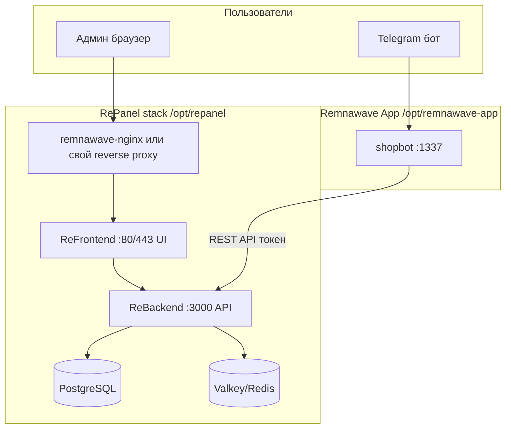

# RePanel — форк Remnawave под свой бренд

Руководство по развёртыванию собственного стека на базе upstream-проектов Remnawave с переименованием в **RePanel / ReFrontend / ReBackend** и интеграцией с **Remnawave App**.

---

## Можно ли «взять под себя»?

**Да**, но с важными условиями.

| Репозиторий upstream | Что это на самом деле | Ваш форк |
|----------------------|------------------------|----------|
| [remnawave/backend](https://github.com/remnawave/backend) | API (NestJS), БД, Redis, `docker-compose-prod.yml` | **ReBackend** |
| [remnawave/frontend](https://github.com/remnawave/frontend) | Веб-интерфейс панели (Vite/React) | **ReFrontend** |
| [remnawave/panel](https://github.com/remnawave/panel) | Сайт документации (Docusaurus), **не** runtime-приложение | **RePanel** (docs) |

Продукт в продакшене = **backend + frontend** (+ опционально subscription-page из отдельного образа). Репозиторий `panel` — это в основном [docs.rw](https://docs.rw), а не контейнер с API.

### Лицензия (обязательно)

Все три репозитория — **AGPL-3.0**. При форке и публичном использовании нужно:

1. Сохранить файл `LICENCE` / `LICENSE` и текст AGPL-3.0.
2. Указать, что проект основан на Remnawave, с ссылкой на оригинал.
3. Публиковать **исходники** ваших изменений (при распространении образов/бинарников — доступ к исходникам тем же способом).
4. Не снимать копирайты upstream; добавить свой: `Copyright (c) 2026 Your Name — modifications`.

> Remnawave App (MIT) и Remnawave (AGPL-3.0) — совместимые copyleft-лицензии, но при публикации связанного стека соблюдайте требования **обеих**.

---

## Архитектура стека



**Remnawave App** не заменяет панель: он ходит в API панели (создание пользователей, ключи, хосты). Без работающего **ReBackend** бот не выдаёт подписки.

---

## План форка (один раз)

### 1. Создать репозитории на GitHub

Под аккаунтом `kissesses` (или организацией):

| GitHub repo | Upstream |
|-------------|----------|
| `kissesses/ReBackend` | `remnawave/backend` |
| `kissesses/ReFrontend` | `remnawave/frontend` |
| `kissesses/RePanel` | `remnawave/panel` |

```bash
# Пример: форк через gh CLI (нужен gh auth login)
gh repo fork remnawave/backend --clone --remote=true --rename ReBackend
gh repo fork remnawave/frontend --clone --remote=true --rename ReFrontend
gh repo fork remnawave/panel --clone --remote=true --rename RePanel
```

Либо вручную: **Fork** на GitHub → `git clone git@github.com:kissesses/ReBackend.git`.

### 2. Добавить upstream для обновлений

В каждом форке:

```bash
git remote add upstream https://github.com/remnawave/backend.git   # или frontend / panel
git fetch upstream
# Периодически: git merge upstream/main  (разрешая конфликты брендинга)
```

### 3. Переименование (чеклист)

Не меняйте слепо все вхождения `remnawave` — часть имён **должна остаться** для совместимости с Remnawave App и co-install.

| Менять на Re* | Оставить как есть (совместимость) |
|---------------|-----------------------------------|
| Название продукта в UI, README, meta title | Docker-сеть `remnawave-network` (Remnawave App ждёт её) |
| `META_TITLE`, логотипы, favicon | Имена volume `remnawave-db-data` (или миграция с дампом) |
| Docker image: `ghcr.io/kissesses/re-backend:2.7.4` | Переменные API, пути `/api/...` — только если готовы патчить Remnawave App |
| GitHub URLs в документации | `REMNAWAVE_PANEL_URL` в subscription-page (внутренний hostname `remnawave`) |

**ReBackend** (`docker-compose-prod.yml`):

```yaml
# Было:
# image: remnawave/backend:2
# container_name: remnawave
# hostname: remnawave

# Стало (после сборки своего образа):
image: ghcr.io/kissesses/re-backend:2.7.4
container_name: remnawave          # можно оставить для Remnawave App/nginx
hostname: remnawave
```

**ReFrontend** — собрать образ и проксировать через nginx на `panel.example.com`.

**RePanel** — только документация; заменить бренд, ссылки на ваши репозитории и домен docs.

### 4. CI: сборка образов

В **ReBackend** / **ReFrontend** добавьте workflow (по аналогии с Remnawave App):

```yaml
# .github/workflows/docker-publish.yml — публикует ghcr.io/kissesses/re-backend
# Теги: v2.7.4, 2, latest
```

Пока образы не собраны, можно временно использовать upstream `remnawave/backend:2` и `remnawave/frontend` — форк тогда только «на будущее».

---

## Установка RePanel на сервере

### Требования

| Параметр | Значение |
|----------|----------|
| ОС | Ubuntu 22.04+ / Debian 11+ |
| RAM | минимум 2 GB, лучше 4 GB |
| Docker | 24+ и Compose v2 |
| Домен | `panel.example.com` (HTTPS) |
| Порты | 443, 80; API/БД — только localhost |

### Шаг 1 — ReBackend (ядро)

```bash
sudo mkdir -p /opt/repanel && cd /opt/repanel

# Вариант A: upstream compose (быстрый старт)
curl -fsSL -o docker-compose.yml \
  https://raw.githubusercontent.com/remnawave/backend/main/docker-compose-prod.yml

# Вариант B: ваш форк
# curl -fsSL -o docker-compose.yml \
#   https://raw.githubusercontent.com/kissesses/ReBackend/main/docker-compose-prod.yml

curl -fsSL -o .env \
  https://raw.githubusercontent.com/remnawave/backend/main/.env.sample

# Секреты
pw=$(openssl rand -hex 24)
sed -i "s/^POSTGRES_PASSWORD=.*/POSTGRES_PASSWORD=$pw/" .env
sed -i "s|^\(DATABASE_URL=\"postgresql://postgres:\)[^@]*\(@.*\)|\1$pw\2|" .env
sed -i "s/^JWT_AUTH_SECRET=.*/JWT_AUTH_SECRET=$(openssl rand -hex 64)/" .env
sed -i "s/^JWT_API_TOKENS_SECRET=.*/JWT_API_TOKENS_SECRET=$(openssl rand -hex 64)/" .env

chmod 600 .env
docker compose pull
docker compose up -d
docker compose logs -f --tail=50
```

Проверка:

```bash
docker ps --format 'table {{.Names}}\t{{.Status}}' | grep -E 'remnawave|repanel'
docker network inspect remnawave-network >/dev/null && echo "OK: remnawave-network"
curl -fsS http://127.0.0.1:3001/health && echo " OK: backend health"
```

### Шаг 2 — ReFrontend (UI)

Следуйте [официальной инструкции](https://docs.rw/docs/install/remnawave-panel) для nginx + frontend: образ `remnawave/frontend` или свой `ghcr.io/kissesses/re-frontend`.

Минимально в nginx Remnawave:

- `/` → frontend (статика/UI)
- `/api` → `http://remnawave:3000`

После установки: `https://panel.example.com` открывается, создаётся первый админ.

### Шаг 3 — API-токен для Remnawave App

В панели: **Settings → API Tokens** → создать токен с правами на users/hosts.

Сохраните:

- URL панели: `https://panel.example.com`
- API token
- Internal URL (в Docker): `http://remnawave:3000`

### Шаг 4 — Remnawave App (co-install)

Когда ReBackend поднят и сеть `remnawave-network` есть — установите Remnawave App по [INSTALL.md](./INSTALL.md#2%EF%B8%8F%E2%83%A3-shopbot) (каталог `/opt/remnawave-app`, `docker compose`).

В nginx Remnawave добавьте прокси на Remnawave App (см. [INSTALL.md — Nginx](./INSTALL.md#-nginx-remnawave)):

```nginx
# shop.example.com → remnawave-app:1337
```

---

## Структура каталогов на сервере

```text
/opt/repanel/                 # ReBackend compose + .env
/opt/remnawave-app/       # Remnawave App (имя каталога можно не менять)
```

Сеть Docker: **`remnawave-network`** — общая для панели и Remnawave App.

---

## Обновление

```bash
# ReBackend
cd /opt/repanel
docker compose pull    # или pull своих образов
docker compose up -d

# Remnawave App
cd /opt/remnawave-app
docker compose pull && docker compose up -d
```

Синхронизация форка с upstream:

```bash
cd ~/ReBackend && git fetch upstream && git merge upstream/main
# Сборка нового образа, тег, push ghcr, затем pull на сервере
```

---

## README для каждого форк-репозитория (шаблон)

Скопируйте в корень **ReBackend** / **ReFrontend** / **RePanel**.

### ReBackend — README.md

```markdown
# ReBackend

API-сервер панели RePanel (форк [remnawave/backend](https://github.com/remnawave/backend)).

## Лицензия

AGPL-3.0. Основано на Remnawave. Изменения © 2026 kissesses.

## Быстрый старт

\`\`\`bash
cp .env.sample .env
# заполнить POSTGRES_PASSWORD, JWT_* 
docker compose -f docker-compose-prod.yml up -d
\`\`\`

Документация по полному стеку: [RePanel Install](https://github.com/kissesses/remnawave-app/blob/main/docs/RE-PANEL-INSTALL.md)
```

### ReFrontend — README.md

```markdown
# ReFrontend

UI панели RePanel (форк [remnawave/frontend](https://github.com/remnawave/frontend)).

## Сборка

\`\`\`bash
npm ci
npm run build
\`\`\`

Docker-образ публикуется в `ghcr.io/kissesses/re-frontend`.

Установка с backend: [RE-PANEL-INSTALL.md](https://github.com/kissesses/remnawave-app/blob/main/docs/RE-PANEL-INSTALL.md)
```

### RePanel — README.md

```markdown
# RePanel Docs

Документация RePanel (форк [remnawave/panel](https://github.com/remnawave/panel)).

\`\`\`bash
npm ci
npm run start
\`\`\`

Runtime (API + UI): ReBackend + ReFrontend.
```

---

## Что Remnawave App менять при глубоком ребрендинге

Если **не** трогаете API и сеть — **ничего** в Remnawave App.

Если переименуете внутренние hostname (`remnawave` → `repanel`):

- `docker-compose.yml` Remnawave App: `remnawave-network` (лучше оставить)
- Настройки хостов в панели бота: URL API

Полная замена бренда «Remnawave» в UI Remnawave App — отдельная задача (шаблоны, `os.json`, docs).

---

## Рекомендуемый порядок работ

1. **Сейчас:** поднять стек по upstream (`remnawave/backend` + frontend) — уже описано в [INSTALL.md](./INSTALL.md).
2. **Форк:** создать `ReBackend`, `ReFrontend`, `RePanel` на GitHub, добавить upstream remote.
3. **Бренд:** UI-строки, README, образы GHCR — без смены API.
4. **CI:** автосборка Docker при теге `v*`.
5. **Remnawave App:** при необходимости — пути `/opt/repanel` в `REMNAWAVE_BACKUP_COMPOSE_DIR` и nginx upstream.

---

## Полезные ссылки

- [Remnawave Panel (upstream)](https://github.com/remnawave/panel)
- [Remnawave Backend](https://github.com/remnawave/backend)
- [Remnawave Frontend](https://github.com/remnawave/frontend)
- [Официальная установка docs.rw](https://docs.rw/docs/install/remnawave-panel)
- [Remnawave App INSTALL](./INSTALL.md)
